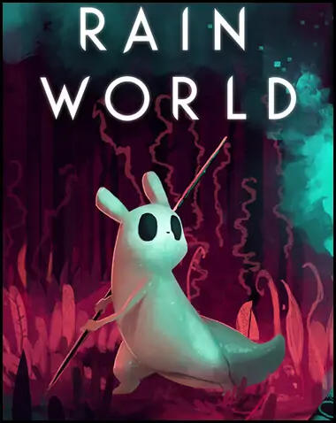

  

### Rain World Wiki?
#### IM 318 Assignment 1

  

  

##### What is Rain World?
Rain world is a platformer game in which the player must survive and explore the remnants of a
long-dead advanced civilization. The player takes control of one of many Slugcats, each with their
own unique capabilities and goals. Slugcats are very low on the food chain, making it difficult to
survive against the various flora and fauna present in the world.
  

  

  
  
  

This is a paragraph.

## This is a subtitle

- this is item 1
- item 2
- item 3

  

  
  

  

### This should be a h3

This should be a paragraph.

- item 1
- item 2
- item 3

  

### This should be a h3

This should be a paragraph.

- item 1
- item 2
- item 3