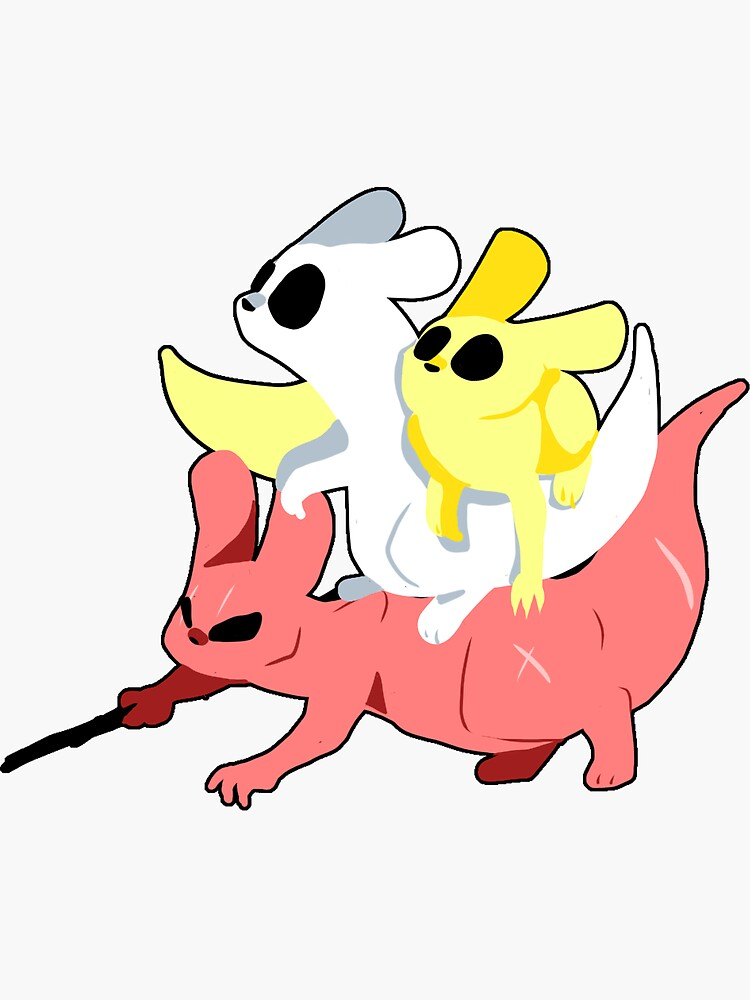
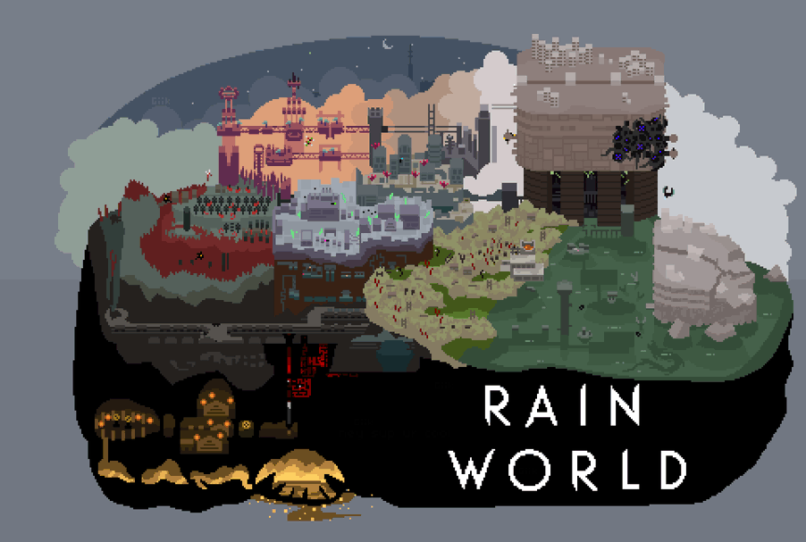

  

### Rain World Wiki?
#### IM 318 Assignment 1

  

  

  ##### What is Rain World?
  Rain world is a platformer game in which the player must survive and explore the remnants of a
  long-dead advanced civilization. The player takes control of one of many Slugcats, each with their
  own unique capabilities and goals. Slugcats are very low on the food chain, making it difficult to
  survive against the various flora and fauna present in the world.
    
  

  

  
  
  
  

  

  ##### What are Slugcats?
  Slugcats are small, nimble creatures that exhibit a higher level of intelligence compared to the rest of
  the creatures found in the world. Slugcats are able to squeeze through small pipes, and they are
  able to hold and throw a variety of items such as spears and rocks. Most slugcats can only eat
  fruits and small bugs, but there are some exceptions.

  

  

  

  

  

  ##### The World
  The game area spans many regions that were once inhabited by the Ancients, a long-dead advanced race.
  The industrial remnants of their technology forms the basis for most of the terrain in the game, but
  many of the structures have been reclaimed by nature.

  

  

  

  

